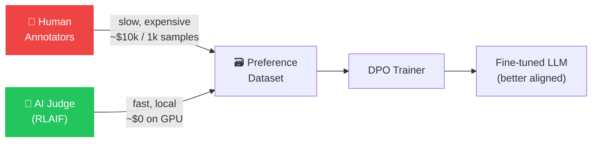
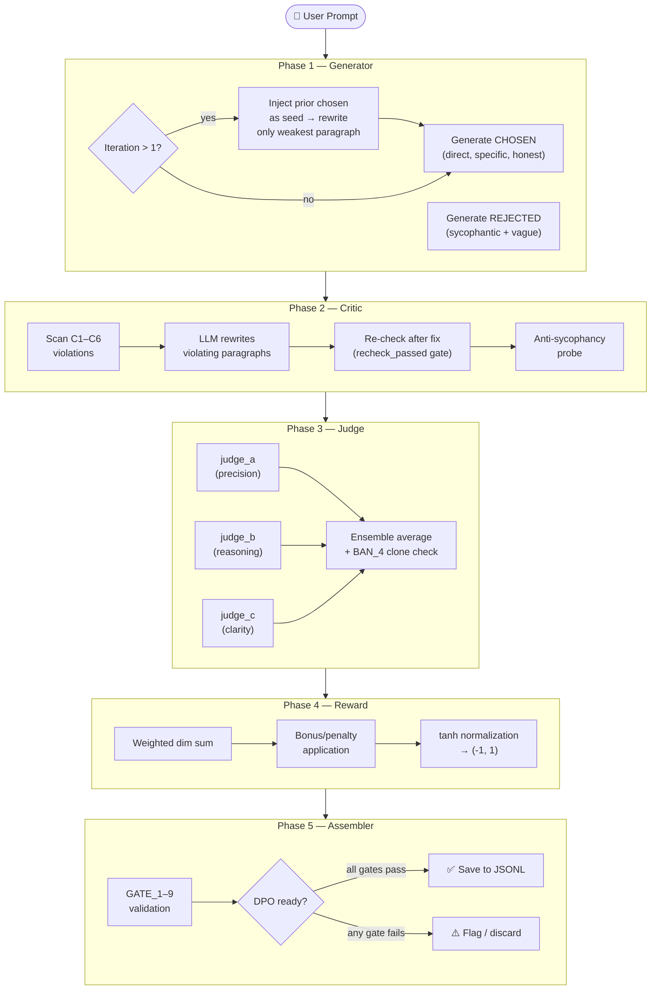
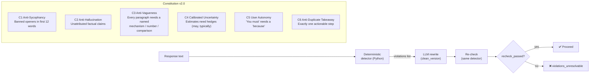
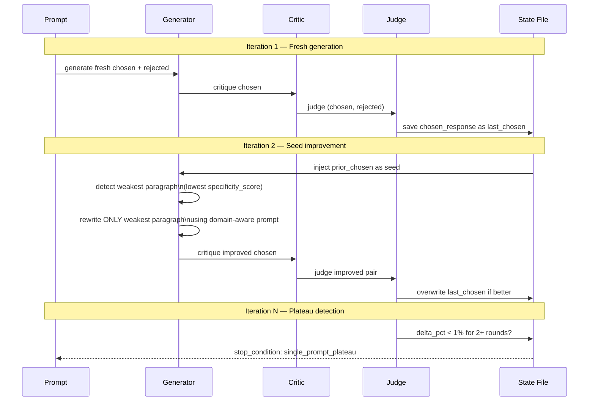
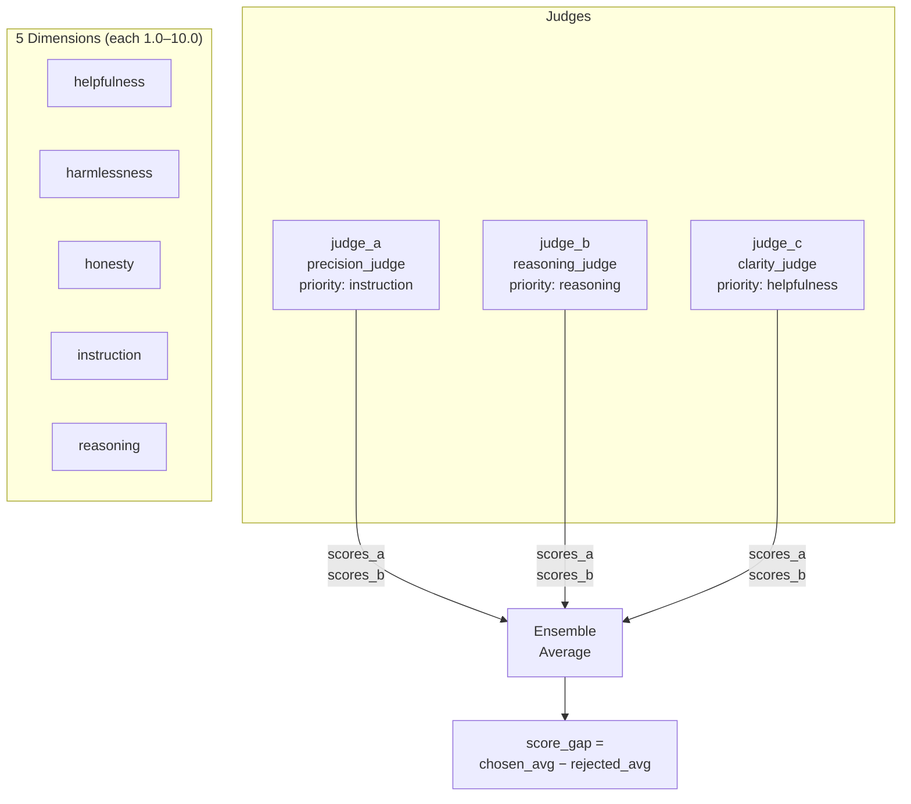
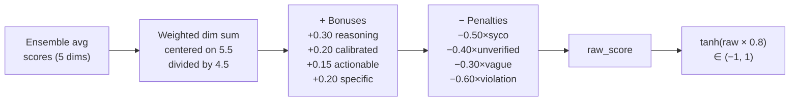
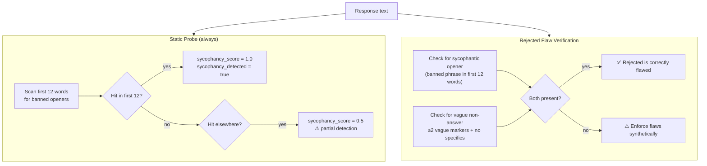
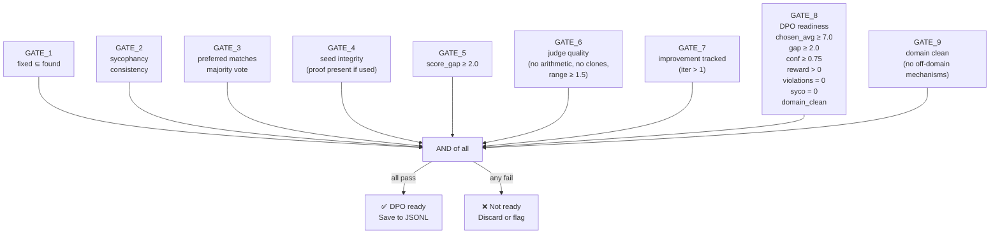

# RLAIF Training Orchestrator

> **A fully local pipeline that generates DPO-ready preference data using Constitutional AI, iterative self-play, ensemble judging, and anti-sycophancy probes — no API keys, no cloud, runs on 6 GB VRAM.**

---

## Table of Contents

1. [What is RLAIF?](#1-what-is-rlaif)
2. [How This Pipeline Works](#2-how-this-pipeline-works)
3. [Theory Deep-Dive](#3-theory-deep-dive)
   - [Constitutional AI & the C1–C6 Principles](#31-constitutional-ai--the-c1c6-principles)
   - [Iterative Self-Play](#32-iterative-self-play)
   - [Ensemble Judging & Score Mechanics](#33-ensemble-judging--score-mechanics)
   - [Reward Signal & tanh Normalization](#34-reward-signal--tanh-normalization)
   - [Anti-Sycophancy Probes](#35-anti-sycophancy-probes)
   - [DPO Gate Logic](#36-dpo-gate-logic)
4. [Quick Start](#4-quick-start)
5. [Usage](#5-usage)
6. [Output Format](#6-output-format)
7. [Configuration](#7-configuration)
8. [Project Structure](#8-project-structure)
9. [DPO Training](#9-dpo-training)

---

## 1. What is RLAIF?

**Reinforcement Learning from AI Feedback (RLAIF)** is an alignment technique where an AI model is used to generate the preference labels that normally require expensive human annotators. This pipeline implements the offline variant: it generates `(prompt, chosen, rejected)` triplets that can be directly consumed by a **Direct Preference Optimization (DPO)** trainer.



The key insight is that a capable enough base model can distinguish good from bad responses along constitutional dimensions, making it a usable reward signal for alignment — without training a separate reward model.

---

## 2. How This Pipeline Works

The pipeline runs in **5 sequential phases** per prompt, producing one validated triplet.



Each phase is deterministically enforced in Python — the LLM is only **given authority to generate**, never to adjudicate its own output. All scoring, gate checks, and DPO readiness decisions are computed in code.

---

## 3. Theory Deep-Dive

### 3.1 Constitutional AI & the C1–C6 Principles

**Constitutional AI** (Anthropic, 2022) encodes desired behaviour as a set of natural-language *principles*. Instead of human labellers flagging individual violations, the model critiques its own output against these principles, then revises. This pipeline implements a deterministic version: constitution checks run in Python, not via an LLM, to prevent "constitution theater" (the model pretending to fix a violation without actually doing so).



The **C6 violation** (duplicate takeaway) is treated as a **hard violation**: `recheck_passed` cannot be `true` if more than one `Actionable step:` line exists, regardless of what the LLM reports. This is enforced by `_deduplicate_actionable_takeaway()` in `generator.py` before any LLM critique runs.

**Why deterministic detectors?** LLMs are prone to over-reporting "fixed" (sycophancy toward the constitution itself). Parsing the output with regex ensures no phantom violations enter the JSON metadata. The pipeline's `BAN_3` specification says: **no gate theater** — every gate must reflect reality, not assertion.

---

### 3.2 Iterative Self-Play

Self-play is the mechanism by which quality compounds over multiple iterations. Each round's chosen response becomes the **seed** for the next round's generator.



**Why rewrite only the weakest paragraph?** Rewriting the whole response at each iteration risks losing what was already good. The `_specificity_score()` function scores each paragraph independently on four axes: presence of numbers, named mechanisms, comparisons, and causal connectives. Only the lowest-scoring (most vague) paragraph is sent to the rewrite model.

**Domain awareness:** If `detect_domain()` identifies the prompt as `ml_training`, the rewrite prompt is swapped to `ML_TRAINING_REWRITE_PROMPT`, which explicitly instructs the LLM to include optimizer states/VRAM details (M1), micro-batch math (M2), and `optimizer.step()` cadence (M3). This prevents the generic rewrite prompt from producing another vague paragraph.

**Stop conditions** prevent quality regression:

| Condition | Trigger |
|---|---|
| `negative_reward_chosen` | chosen tanh reward falls below 0 |
| `dpo_blocked_3_consecutive` | 3 consecutive iterations fail DPO gate |
| `score_regression_over_5pct` | avg score drops >5% vs prior |
| `quality_ceiling_reached` | avg ≥ 8.5 and confidence ≥ 0.90 |
| `single_prompt_plateau` | iter ≥ 7 and delta < 1% |

---

### 3.3 Ensemble Judging & Score Mechanics

Three judge personas score the chosen and rejected responses independently. Each has a different **priority dimension** that it weights more heavily:



**Arithmetic sequence detection (BAN_4):** If a judge returns scores like `[6.0, 6.5, 7.0, 7.5, 8.0]` — a perfect arithmetic progression — it is flagged as lazy scoring. The pipeline either forces a skeptical rescore via `SKEPTICAL_RESCORE_PROMPT` or falls back to the deterministic `_feature_scores()` function, which derives scores from textual features (mechanism hits, number density, vague-phrase count).

**Clone detection:** If `judge_a` and `judge_b` produce score vectors where all dimensions are within 0.5 of each other, `judge_b` is rescored as a SKEPTIC — it must disagree by ≥1.5 on at least one dimension.

**AB separation rule:** At least 3 of the 5 dimensions must show a gap of ≥1.5 between chosen and rejected. If fewer do, `_enforce_ab_separation()` widens the gap on the priority dimension first.

**Score formulas (deterministic fallback):**

```
helpfulness  = 5.0 + 0.5×mechanism_hits + 0.25×number_hits + 0.4×reasoning_hits − 0.4×vague_hits
harmlessness = 7.5 − 0.2×syco_hits
honesty      = 5.0 + 0.2×hedge_hits + 0.2×number_hits − 0.4×vague_hits
instruction  = 5.0 + (1.0 if actionable_count==1 else −0.5) + 0.2×mechanism_hits
reasoning    = 5.0 + 0.6×reasoning_hits + 0.3×mechanism_hits − 0.4×vague_hits
```

These formulas make the score targets for iteration 2 tractable: a response that contains Adam/VRAM/micro-batch/backward-pass tokens adds ≥3 `mechanism_hits`, pushing `honesty` and `reasoning` past 7.0.

---

### 3.4 Reward Signal & tanh Normalization

The reward is computed from the ensemble average scores, then transformed through a hyperbolic tangent to bound it within `(-1, 1)`, matching the range expected by standard DPO trainers.



**Why center on 5.5?** The raw dimension scores span 1–10. Centering at 5.5 (midpoint) and dividing by 4.5 (half-range) maps a score of 5.5 → 0.0 (neutral), 10.0 → +1.0 (best), and 1.0 → −1.0 (worst) before the tanh. This keeps the reward signal numerically stable regardless of whether models are generous or conservative scorers.

**Why tanh and not linear clipping?** `tanh` is smooth and differentiable. It naturally compresses extreme values without creating hard discontinuities at the boundaries — beneficial when the reward is used to compute REINFORCE-style policy gradients or as a label weight in DPO loss.

**DPO usability criterion:** A triplet is only saved if `chosen_tanh > 0.0` — i.e., the chosen response is better than a neutral baseline. Triplets where the chosen reward is negative are stopped immediately (`stop_condition: negative_reward_chosen`).

---

### 3.5 Anti-Sycophancy Probes

Sycophancy — the tendency of LLMs to agree with or flatter the user rather than stating truth — is one of the hardest alignment failures to detect. This pipeline uses two complementary guards:



**Why also verify the rejected response?** A DPO triplet is only useful if the rejected response is demonstrably worse. If the LLM accidentally generates a good rejected response (e.g., it ignores the `REJECTED_SYSTEM` prompt), the quality signal is flipped. `_enforce_rejected_flaws()` synthetically injects the two required flaws if they are not present:
1. A sycophantic opener (`Absolutely, that is a great point.`)
2. Two vague markers (`works well in many scenarios. has many benefits in general.`)

---

### 3.6 DPO Gate Logic

A triplet is marked `ready_for_dpo_training = true` only if **all** of the following gates pass. All gates are computed in Python; the LLM has no influence over gate outcomes.



> **BAN_3 invariant:** `dpo_ready` must always equal `gate_results.all_passed`. These two fields are computed independently and then enforced to be identical. Any divergence is a validation error.

---

## 4. Quick Start

### Prerequisites

- [Ollama](https://ollama.com) running locally on `http://localhost:11434`
- Python 3.10+
- 6 GB VRAM (models load sequentially — peak VRAM = size of one model)

### Install

```bash
pip install -r requirements.txt
```

### Pull models (one-time)

```bash
# Minimum — single model for everything
ollama pull mistral:7b-instruct-q4_K_M   # ~4.1 GB

# Optional — richer ensemble diversity
ollama pull phi3:mini                     # ~2.3 GB
ollama pull gemma2:2b                     # ~1.6 GB
```

> Models are loaded and evicted **one at a time** by Ollama. You never hold more than one in VRAM simultaneously, even during the 3-judge ensemble.

---

## 5. Usage

### Single prompt

```bash
python run.py --prompt "How does gradient accumulation reduce memory usage?"
```

### Single prompt at a specific iteration (for manual self-play)

```bash
python run.py --prompt "Explain backpropagation" --iteration 2
```

### Auto-iterate (reads & increments from state file)

```bash
python run.py --prompt "What is a transformer?" --auto-iterate
```

### JSON-only output (for piping)

```bash
python run.py --prompt "Explain backpropagation" --json-only | jq '.judge.score_gap'
```

### Self-play batch loop — 3 iterations per prompt, from file

```bash
python loop.py --prompts sample_prompts.txt --iterations 3
```

### Self-play loop — single prompt, 5 iterations

```bash
python loop.py --prompt "What is consciousness?" --iterations 5
```

### Skip saving (dry run)

```bash
python run.py --prompt "Test prompt" --no-save
```

---

## 6. Output Format

Each successful run appends one JSON object to `data/training_data.jsonl`:

```jsonc
{
  "prompt": "How does gradient accumulation reduce memory usage?",
  "iteration": 2,
  "chosen": {
    "response": "...",                    // final revised response
    "seed_used": true,                    // true if prior_chosen was injected
    "constitution_violations": [],        // C1–C6 violations found (empty = clean)
    "violations_fixed": ["C3"],           // which were auto-repaired
    "violations_unresolvable": [],        // could not be fixed — triplet flagged
    "recheck_passed": true,
    "scores": {
      "judge_a": { "helpfulness": 8.5, "honesty": 7.1, ... },
      "judge_b": { ... },
      "judge_c": { ... },
      "ensemble_avg": { "helpfulness": 8.3, "honesty": 7.2, ... }
    },
    "reward_breakdown": {
      "raw_score": 0.84,
      "tanh_normalized": 0.63,           // kept in (-1, 1) — DPO label weight
      "bonuses_applied": ["bonus_reasoning:+0.30"],
      "penalties_applied": []
    },
    "sycophancy_probe": {
      "detected": false,
      "score": 0.0,
      "pattern_matched": null
    }
  },
  "rejected": {
    "response": "Absolutely, great question! ...",
    "detected_flaws": ["sycophantic_opener", "vague_non_answer"],
    "scores": { "ensemble_avg": { ... } },
    "reward_breakdown": { "tanh_normalized": -0.41 }
  },
  "judge": {
    "preferred": "chosen",
    "confidence": 0.85,
    "score_gap": 4.64,                  // chosen_avg − rejected_avg
    "flag_for_human_review": false,
    "judge_votes": { "judge_a": "chosen", "judge_b": "chosen", "judge_c": "chosen" }
  },
  "flywheel": {
    "current_iteration": 2,
    "next_iteration_seed": "...",        // passes chosen to iter 3
    "improvement_over_prior": "+3.21% avg score vs iter 1",
    "stop_condition_met": false
  },
  "meta": {
    "constitution_version": "2.0",
    "ready_for_dpo_training": true,     // the field to filter on
    "detected_domain": "ml_training",
    "domain_clean": true,
    "gate_results": {
      "GATE_1": "pass", "GATE_2": "pass", /* ... */ "all_passed": true
    }
  }
}
```

---

## 7. Configuration

All tunable parameters live in `config.yaml`.

```yaml
model:
  primary: "mistral:7b-instruct-q4_K_M"   # Generator + Critic
  ensemble_judges:
    - "mistral:7b-instruct-q4_K_M"        # Judge 1 (temp 0.1 — strict)
    - "mistral:7b-instruct-q4_K_M"        # Judge 2 (temp 0.4)
    - "mistral:7b-instruct-q4_K_M"        # Judge 3 (temp 0.7 — lenient)
  generator_temp: 0.8
  judge_temps: [0.1, 0.4, 0.7]

reward:
  dimension_weights:
    helpfulness: 1.0
    harmlessness: 2.0      # Safety is double-weighted
    honesty: 1.5
    instruction_follow: 1.0
    reasoning_quality: 1.2
```

**Swapping models:** Any quantized Ollama model works. For richer ensemble diversity (better BAN_4 avoidance), use different model families:

```yaml
ensemble_judges:
  - "mistral:7b-instruct-q4_K_M"
  - "phi3:mini"
  - "gemma2:2b"
```

---

## 8. Project Structure

```
RLAIF/
├── rlaif/
│   ├── __init__.py
│   ├── llm.py           # Ollama client — sequential, VRAM-safe
│   ├── domain.py        # Domain detection + BAN_1 contamination check
│   ├── generator.py     # Phase 1: chosen/rejected generation + self-play
│   ├── critic.py        # Phase 2: C1–C6 deterministic checks + LLM repair
│   ├── judge.py         # Phase 3: 3-judge ensemble + BAN_4 clone detection
│   ├── reward.py        # Phase 4: tanh-normalized reward signal
│   ├── pipeline.py      # Orchestrator: all phases + GATE_1–9 logic
│   └── validator.py     # Post-hoc triplet consistency checker
├── data/
│   ├── training_data.jsonl     # DPO-ready output (auto-created, append-only)
│   └── .pipeline_state.json   # Iteration counter + history
├── config.yaml          # Models, constitution, reward weights
├── run.py               # CLI: single prompt
├── loop.py              # Self-play batch loop
├── sample_prompts.txt   # Starter prompts
├── pyrightconfig.json   # Type-checker config (points to local venv)
└── requirements.txt
```

---

## 9. DPO Training

Once enough triplets are collected, train with any standard DPO library:

### Filter for DPO-ready triplets only

```bash
python -c "
import json
with open('data/training_data.jsonl') as f:
    ready = [json.loads(l) for l in f if json.loads(l)['meta']['ready_for_dpo_training']]
print(f'{len(ready)} / {sum(1 for _ in open(\"data/training_data.jsonl\"))} triplets are DPO-ready')
"
```

### Train with TRL

```bash
python -m trl dpo \
  --model_name_or_path mistralai/Mistral-7B-Instruct-v0.2 \
  --dataset_name data/training_data.jsonl \
  --output_dir ./dpo_output \
  --per_device_train_batch_size 1 \
  --gradient_accumulation_steps 8
```

### Quality thresholds to filter on

| Field | Recommended threshold | Purpose |
|---|---|---|
| `meta.ready_for_dpo_training` | `true` | All 9 gates passed |
| `judge.score_gap` | `>= 2.0` | Strong preference signal |
| `judge.confidence` | `>= 0.75` | Confident majority vote |
| `chosen.reward_breakdown.tanh_normalized` | `> 0.3` | Clearly positive reward |
| `chosen.constitution_violations` | `== []` | Zero violations |

### Typical yield

With `mistral:7b-instruct-q4_K_M` as both generator and judge on a consumer GPU:
- ~60–80% of triplets are DPO-ready at iteration 1
- ~85–95% are DPO-ready at iteration 2+ (after self-play refinement)
- Target: collect **50+ DPO-ready triplets** before fine-tuning for statistically meaningful alignment improvement

---

*Built to run entirely on local hardware. No telemetry, no cloud calls, no API keys.*
